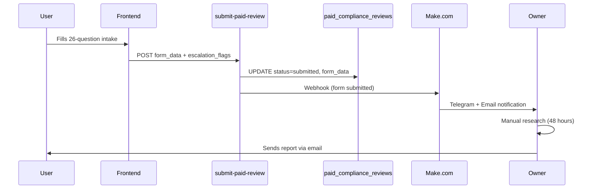
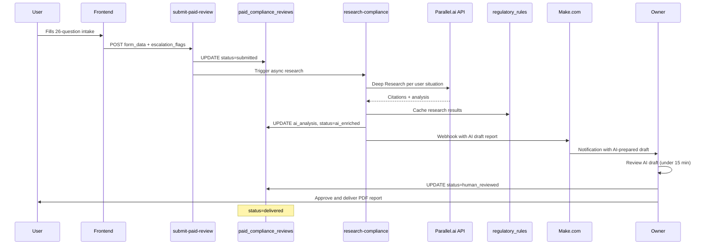

# Parallel.ai Integration for Compliance Review Backend

## Problem

All Portugal tax compliance rules are **hardcoded** in `[src/utils/taxCheckupEnhancements.ts](src/utils/taxCheckupEnhancements.ts)` (last updated Jan 1, 2026). The paid review is **manual**: user pays, fills 26-question form, owner researches and writes a report in 48 hours. This does not scale for a solo founder and the rules go stale.

## Current Architecture (What Exists)




**Key files involved:**

- `[supabase/functions/submit-paid-review/index.ts](supabase/functions/submit-paid-review/index.ts)` -- handles form submission, saves to DB, triggers Make.com
- `[src/utils/taxCheckupEnhancements.ts](src/utils/taxCheckupEnhancements.ts)` -- hardcoded rules with penalties, deadlines, thresholds
- `[src/lib/paidComplianceReviews.ts](src/lib/paidComplianceReviews.ts)` -- escalation flags, ambiguity scoring
- `[src/lib/taxCheckup.ts](src/lib/taxCheckup.ts)` -- compliance score calculation

**Key database tables:**

- `paid_compliance_reviews` -- stores form_data (JSONB, 26 fields), escalation_flags, status
- `tax_checkup_leads` -- 91 free checkup leads with compliance scores
- `regulatory_rules` -- DOES NOT EXIST YET

## Proposed Architecture (With Parallel.ai)




## Three Phases

### Phase 1: Auto-Enrich Intake on Submission (build first)

**What it does:** When a paid review is submitted, a new Edge Function calls Parallel.ai to research the specific regulations that apply to that user's situation. The result is stored in the database so the owner just validates instead of researching from scratch.

**New Edge Function: `research-compliance/index.ts`**

- Triggered by `submit-paid-review` after form submission (async, does not block the user)
- Reads `form_data` from `paid_compliance_reviews`
- Constructs research queries based on the user's specific answers (e.g., "Portugal VAT registration requirements 2026 for freelancer earning 25k-50k EUR" or "NHR IFICI eligibility rules 2026 for US tax resident relocating to Portugal")
- Calls Parallel.ai Deep Research API (or Search API for faster results)
- Stores results in new `ai_research_results` JSONB column on `paid_compliance_reviews`
- Updates review status to `ai_enriched` (never skips to `delivered`)
- Triggers Make.com webhook with AI analysis attached

**Database changes (migration):**

- Add columns to `paid_compliance_reviews`:
  - `ai_research_results` (JSONB) -- raw Parallel.ai output with citations
  - `ai_draft_report` (TEXT) -- formatted draft report for owner review
  - `ai_research_status` (TEXT) -- 'pending', 'completed', 'failed'
  - `ai_researched_at` (TIMESTAMPTZ)
  - `reviewed_by` (TEXT) -- owner identifier who approved the report
  - `reviewed_at` (TIMESTAMPTZ) -- when human review was completed
  - `delivered_at` (TIMESTAMPTZ) -- when report was sent to user

**Explicit status chain (never skip `human_reviewed`):**

- `submitted` -- user completed and submitted intake form
- `ai_enriched` -- Parallel.ai research completed, draft ready for review
- `human_reviewed` -- owner approved the report (mandatory step)
- `delivered` -- PDF sent to user

**Parallel.ai API call pattern:**

- Use Deep Research for comprehensive per-user analysis
- Input: structured prompt built from form_data (residency status, income, registrations, cross-border exposure)
- Output: structured analysis with citations to official Portuguese sources (Portal das Financas, Seguranca Social, AT)

**What the owner gets:** Instead of a blank notification saying "new form submitted", the Make.com webhook now includes a pre-written AI draft report with citations. Owner validates, edits if needed, and delivers. 48 hours becomes 15 minutes.

### Phase 2: Dynamic Regulatory Rules Database (keep rules fresh)

**What it does:** Replaces hardcoded rules in `taxCheckupEnhancements.ts` with a database-driven rules engine that Parallel.ai keeps current.

**New database table: `regulatory_rules`**

```
id, rule_category, rule_id, title, description,
threshold_value, penalty_info, deadline_info,
source_url, source_name, last_verified_at,
effective_from, effective_until, is_active,
created_at, updated_at
```

**New Edge Function: `update-regulatory-rules/index.ts`**

- Triggered on a schedule (weekly via pg_cron or external cron)
- For each rule category (VAT, NISS, NIF, NHR/IFICI, crypto, cross-border):
  - Calls Parallel.ai Search API to check for updates
  - Compares with current stored rules
  - Updates rules if changes detected
  - Logs changes for audit trail

**Refactor `taxCheckupEnhancements.ts`:**

- Instead of hardcoded thresholds, fetch from `regulatory_rules` table at runtime
- Fallback to hardcoded values if DB fetch fails (safety net)
- This means the free checkup AND paid review both use fresh rules

### Phase 3: AI Draft Report with Human Approval (assistive, not autonomous)

**Core principle: AI drafts. Human approves. Always.**

This product is compliance-adjacent. The moment you auto-deliver, you implicitly become an advisor and inherit legal and reputational risk. One hallucinated rule or outdated source destroys trust. The human review step is not a bottleneck to optimize away. It IS the product.

**What it does:**

- Combines Phase 1 (per-user research) + Phase 2 (current rules) into a structured draft report
- Generates per-section verdicts: Ready, Blocked, or Escalate
- Includes citations to official Portuguese sources for every finding
- Includes uncertainty notes where AI confidence is low
- Stores draft for owner review in admin UI -- never sends to user automatically

**What it does NOT do:**

- Does not send report to user
- Does not mark status as `delivered`
- Does not bypass `human_reviewed` step

**Report schema (PDF output):**

- Header: Worktugal branding, report date, case reference
- Section 1: Executive Summary (Ready / Blocked / Escalate overall status)
- Section 2: Residency and Tax Status (verdict + findings + citations)
- Section 3: Activity and Income Registration (verdict + findings + citations)
- Section 4: VAT Compliance (verdict + findings + citations)
- Section 5: Social Security (verdict + findings + citations)
- Section 6: Cross-Border Exposure (verdict + findings + citations)
- Section 7: Special Regimes -- NHR/IFICI (verdict + findings + citations)
- Section 8: Recommended Next Steps (prioritized action list)
- Footer disclaimers (mandatory on every page):
  - "This is not legal or tax advice."
  - "Information sourced from official Portuguese authorities."
  - "Final decisions should be confirmed with a licensed professional."
  - "AI-assisted review, human verified."

**Owner review workflow:**

1. AI draft appears in admin view (`/admin/paid-reviews`)
2. Owner reviews each section (edits language, adds context)
3. Owner clicks "Approve and deliver"
4. System generates PDF
5. PDF emailed to user via Make.com
6. Status updated to `delivered`

**SLA positioning:**

- Promise: "Delivered within 24-48 hours"
- Reality with Phase 1+2+3: owner reviews in under 15 minutes, can deliver same day
- Faster delivery with same quality is a competitive advantage, but never promise "instant"

This phase connects directly to the Readyfile reframe plan (copy changes already planned).

## Legal Positioning (baked into every output)

**What Worktugal IS:**

- Risk identification layer
- Compliance readiness assessment
- Source-backed information aggregation
- Pre-accountant preparation tool

**What Worktugal is NOT:**

- Tax advisor
- Legal advisor
- Filing service

Every report, every email, every UI surface that shows compliance findings must include calm, explicit disclaimers. This increases trust, it does not reduce it.

## What Does NOT Change

- Stripe checkout flow (same €49 product, same price ID)
- Make.com scenarios (enhanced with richer webhook data, not replaced)
- Frontend intake form (same 26 questions, same form_data structure)
- Free tax checkup flow (benefits from Phase 2 fresh rules)
- Supabase RLS policies (new columns inherit existing policies)
- User-facing routes

## API Key Management

- Store `PARALLEL_API_KEY` as a Supabase Edge Function secret (same pattern as `STRIPE_SECRET_KEY`)
- All Parallel.ai calls happen server-side in Edge Functions (never exposed to frontend)

## Risk Assessment

- **Safe for current stack:** Phase 1 adds a new Edge Function and DB columns. Existing flows are untouched.
- **No breaking changes:** `submit-paid-review` triggers research async after saving to DB. If Parallel.ai is down, the review still works manually as today.
- **Rollback:** Remove the async trigger in `submit-paid-review`. AI columns remain but are unused.
- **Cost:** Parallel.ai pricing applies per API call. Deep Research is more expensive than Search. Start with Search for Phase 1, upgrade to Deep Research when value is proven.

## Recommended Build Order

Start with Phase 1 (auto-enrich) because it has the highest immediate impact: it turns the manual 48-hour review bottleneck into a 15-minute validation task. This is the fastest path to scaling the paid product.

Phase 2 (rules DB) can run in parallel or after Phase 1. It improves both the free checkup and paid review accuracy.

Phase 3 (AI draft + human approval) builds on both. It generates the report draft and PDF, but human review before delivery is permanent -- this is a trust product, not an automation product.