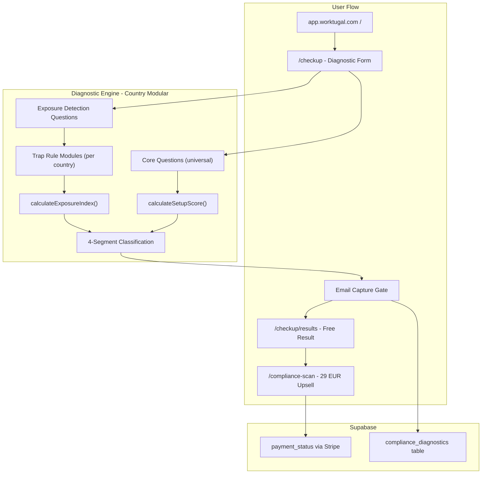
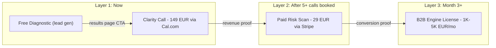

# Diagnostic Engine v2: Rebuild Plan

## Situation

Two disconnected apps. 865 proven leads with zero contact data. A dead 49 EUR product. A positioning gap between "tax compliance" messaging and a readiness checklist tool. ChatGPT produced a strong v2 spec (dual scoring, trap matrix, country modularity) but Gemini destroyed the codebase trying to implement it. Starting fresh with Opus.

## Architecture




## Key Design Decisions

- **Non-destructive**: The existing TaxCheckupForm and CheckupResults stay in place. The new diagnostic lives alongside them with a code-level feature flag. Once validated, the old form is retired.
- **Country-modular from day one**: Trap rules are declarative config objects (not embedded functions), evaluated by a small engine. Portugal is the first module. The engine function takes `country_target` as input.
- **Email gate before results, no auth required**: After the user completes all questions, they see "Analyzing your setup..." then an email capture screen. No results without email. No Supabase Auth signup required. Anonymous submission with email. If the user later creates an account, the diagnostic record is linked retroactively via nullable `user_id`.
- **Dual scoring**: Setup Score (existing weighted logic from [quizQuestions.md](resources/worktugal%20set%20up%20check/quizQuestions.md)) plus Exposure Index (trap rule accumulation from [v2 spec](resources/worktugal%20set%20up%20check/worktugal-diagnostic-engine-v2-spec.md)).
- **Phased question rollout**: Phase 1 uses the original Setup Check 12 questions exactly (preserves benchmark continuity with 865 records). Phase 2 adds the 6 exposure detection questions. The UX styling comes from TaxCheckupForm's dark theme.
- **Single table name, frozen**: `compliance_diagnostics`. Never `diagnostics`. Never changes.
- **raw_answers jsonb, not individual columns**: All quiz answers stored as a single jsonb column. Keeps schema stable as questions evolve. Individual answer fields are NOT columns.
- **Versioning**: Every record stores `diagnostic_version` and `ruleset_version` so data from different quiz iterations can be compared.

## Phase 1: Engine and Schema (Days 1-3)

### 1.1 Create diagnostic engine module

New file: `src/lib/diagnostic/engine.ts`

- `calculateSetupScore(answers, country)` - adapted from existing `calculateScore` in [quizQuestions.md](resources/worktugal%20set%20up%20check/quizQuestions.md)
- `calculateExposureIndex(answers, country)` - new, based on trap rules
- `classifySegment(setupScore, exposureIndex)` - returns one of 4 segments
- `getTriggeredTraps(answers, country)` - returns array of trap objects with severity, fix description

### 1.2 Create trap rule module for Portugal

New file: `src/lib/diagnostic/rules/portugal.ts`

- 6 trap rules from the v2 spec: dual tax residency, VAT misclassification, unfiled IRS, permit expiry risk, Schengen miscalculation, SS misalignment
- Each rule is a declarative config object with source citations:

```
  {
    id: "dual_tax_residency",
    conditions: { tax_residence: "yes", foreign_tax_deregistration: ["no", "unsure"] },
    exposureScore: 15,
    severity: "high",
    fix: "Tax residency alignment review",
    legal_basis: "CIRS Art. 16 - 183-day rule + habitual abode",
    source_url: "https://www.oecd.org/content/dam/oecd/en/topics/policy-issue-focus/aeoi/portugal-tax-residency.pdf",
    penalty_range: null,
    last_verified: "2026-03-05"
  }
  
```

- The engine evaluates conditions dynamically (AND logic between fields, array values treated as OR for a single field)
- Export as `PortugalTrapRules` with a `RULESET_VERSION` constant
- Every numeric claim, deadline, or penalty range must trace to a `source_url`

### 1.3 Create Supabase migration

Table name frozen: `compliance_diagnostics`

- `id` (uuid, PK, default gen_random_uuid())
- `user_id` (uuid, nullable FK to auth.users) -- linked retroactively on account creation
- `email` (text, NOT NULL)
- `country_target` (text, default 'portugal')
- `setup_score` (integer)
- `exposure_index` (integer)
- `segment` (text)
- `raw_answers` (jsonb) -- all quiz answers as single JSON object
- `trap_flags` (jsonb) -- triggered trap IDs and details
- `utm_source`, `utm_medium`, `utm_campaign` (text)
- `payment_status` (text, default 'free')
- `diagnostic_version` (text) -- e.g. "2.0"
- `ruleset_version` (text) -- e.g. "portugal_v1"
- `created_at` (timestamptz, default now())

RLS: anonymous insert via service role. User-based read/update once user_id is linked.

### 1.4 Define question set (Phase 1: Setup questions only)

New file: `src/lib/diagnostic/questions.ts`

- Reuse the original Setup Check 12 questions exactly as they exist in [quizQuestions.md](resources/worktugal%20set%20up%20check/quizQuestions.md)
- Keep the existing weight and skip logic unchanged
- Export as typed array with `DIAGNOSTIC_VERSION` constant
- The 6 exposure detection questions are NOT included in Phase 1 (added in Phase 2 to preserve benchmark continuity with 865 historical records)

## Phase 2: UI Implementation (Days 3-6)

### 2.1 Build new diagnostic form component

New file: `src/components/diagnostic/DiagnosticForm.tsx`

- 4-step flow: Setup Questions -> Exposure Questions -> Email Gate -> Results
- Reuse the existing TaxCheckupForm's dark UI style and motion animations from [TaxCheckupForm.tsx](src/components/accounting/TaxCheckupForm.tsx)
- Progress bar, step indicators, micro-insights between questions ("Most freelancers get this wrong")
- Email is mandatory before results reveal
- Stores UTM params from URL

### 2.2 Build results component

New file: `src/components/diagnostic/DiagnosticResults.tsx`

- Two score displays: Setup Score and Exposure Index
- 4-segment messaging (from v2 spec)
- Free tier: shows top 2-3 triggered traps with severity labels
- Upsell CTA: "Unlock your full Compliance Risk Scan" for 29 EUR
- Comparison stat: "Average Setup Score: 72 / Your score: XX" (based on real 865-record data)

### 2.3 Wire routes

Update [App.tsx](src/App.tsx):

- Keep existing `/checkup` route pointing to TaxCheckupForm behind a feature flag
- Add `/diagnostic` route for the new engine (temporary, for testing)
- Once validated, swap `/checkup` to point to DiagnosticForm

## Phase 3: Monetization and Tracking (Days 6-9)

### 3.1 Stripe checkout for Compliance Risk Scan

- Adapt the existing ConsultCheckout pattern from [ConsultCheckout.tsx](src/components/accounting/ConsultCheckout.tsx)
- Product: "Compliance Risk Scan" at 29 EUR
- On payment success: update `payment_status` in Supabase, show full trap breakdown with action checklists

### 3.2 Admin panel for diagnostic leads

- Extend or clone the existing [TaxCheckupLeads.tsx](src/components/admin/TaxCheckupLeads.tsx) admin panel
- Show all diagnostic completions with email, scores, segment, payment status
- Filter by segment (High Setup / High Exposure = hottest leads)

### 3.3 UTM and analytics instrumentation

- Capture `utm_source`, `utm_medium`, `utm_campaign` from URL params (already partially done in TaxCheckupForm)
- Store `anonymous_id` cookie for multi-session tracking
- Fire conversion events on: quiz completion, email capture, paid scan purchase

## Phase 4: Positioning and Launch (Days 9-12)

### 4.1 Update homepage messaging

Modify [ModernHero.tsx](src/components/accounting/ModernHero.tsx):

- Change headline from "Are you tax compliant in Portugal?" to something that names the hidden risk (e.g., "You might look compliant. But are you exposed?")
- Replace the 49 EUR "Detailed Review" CTA with the 29 EUR "Risk Scan" or remove it entirely
- Keep the free checkup as primary CTA

### 4.2 Kill or archive dead routes

- The `/compliance-review` (PaidReviewPage) has zero conversions. Archive it.
- The `/accounting` desk, intake, and accountant application flows should be evaluated for removal if they have zero usage.

### 4.3 Redirect setup.apps.worktugal.com

- Point the old Setup Check subdomain to `app.worktugal.com/checkup` with a 301 redirect
- Preserve any existing backlinks and SEO

## Phase 5: Data Freshness via Parallel.ai (Days 12-14)

### 5.1 Source-cited trap rules

Every trap rule in `portugal.ts` already includes `source_url`, `legal_basis`, `penalty_range`, and `last_verified` (built into Phase 1.2). These fields serve double duty: they power the user-facing "Verified against official sources" badge on the homepage AND they define the monitoring targets for Parallel.ai.

Key source URLs to monitor (derived from the [002 Compliance Traps research](resources/parallel%20research%20files/002%20Portugal%20Expat%20Compliance%20Traps%202021%E2%80%932026_%20Where%20Residency%20Meets%20Risk.md)):

- AT fiscal address rules: `info.portaldasfinancas.gov.pt`
- Law 23/2007 immigration penalties: `files.dre.pt/StaticContent/Lei_23_2007_EN.pdf`
- Social Security contributions: `www2.gov.pt/en/servicos/obter-informacoes-sobre-as-contribuicoes-para-a-seguranca-social-pagamento-de-trabalhador-independente`
- Bank KYC / AML guidance: `www.bportugal.pt/page/sua-conta-foi-bloqueada-eis-como-resolver`
- SNS user number requirements: `www2.gov.pt/en/servicos/pedir-o-numero-de-utente-do-sns`
- NISS registration: `www2.gov.pt/en/servicos/pedir-o-numero-de-identificacao-da-seguranca-social-niss-`
- IFICI/NHR regime updates: `kpmg.com/xx/en/our-insights/gms-flash-alert/`

### 5.2 Parallel.ai Monitor API setup

- Create one monitor per source URL using the Parallel.ai Monitor API
- Set cadence to `weekly` for government pages, `daily` for tax alert pages (KPMG, PwC)
- Configure webhook endpoint (Cloudflare Worker or Make.com) to receive change notifications
- Webhook handler sends Van an email/Slack notification with: which URL changed, what the change summary is, which trap rule(s) reference that URL
- Human review required before any rule update. No auto-updates.

### 5.3 Quarterly search sweep script

- A simple script (can be a Cloudflare Worker on a cron or a Make.com scenario) that runs every 90 days
- Uses Parallel.ai Search API with targeted queries:
  - "Portugal IRS filing deadlines [current year] changes"
  - "Portugal freelancer VAT threshold [current year]"
  - "AIMA residence permit renewal fees [current year]"
  - "Portugal social security contribution rates [current year]"
  - "Portugal non habitual resident regime [current year] update"
- Results are compared against current trap rule claims
- Output: a verification report listing each rule, its current claim, search results, and whether a discrepancy was found
- Van reviews the report. If rules need updating: update `portugal.ts`, bump `RULESET_VERSION`, update `last_verified` dates

### 5.4 Display freshness signal in product

- The homepage badge "Verified against official sources: [date]" is computed from the minimum `last_verified` date across all active trap rules
- The diagnostic results page shows per-trap source citations for the paid tier (adds credibility and justifies the 29 EUR)

## Monetization Ladder (Resequenced v2.5 — March 8, 2026)

Three layers, resequenced based on what actually made money historically. The clarity call is Layer 1 because Van has proven people pay for his time on a call. The 29 EUR paid scan is Layer 2 because it requires Stripe integration and has never converted. Each layer validates the next.




### Layer 1: Clarity Call (149 EUR) -- NOW

- Free diagnostic captures email + full risk profile (scores, traps, segment)
- Results page shows top 2 traps, locked traps teaser, and CTA: "Book a Clarity Call -- 149 EUR"
- Van walks into the call pre-briefed by the diagnostic data (no manual research needed)
- Call is 30 minutes via Google Meet or Zoom. No Notion report afterward. Diagnostic results page IS the report.
- After the call: warm referral to vetted tax advisor or lawyer if needed (referral fee 200-500 EUR per qualified lead)
- Make.com fires Telegram + email notification on every new submission so Van can personally follow up with high-risk profiles
- Revenue math: 3 calls/month = 447 EUR. 6 calls/month = 894 EUR. Plus referral fees.
- Distribution: Luma blast to 1,253 subs, monthly IRL event, Reddit posts, direct email follow-up to high-risk submissions

### Layer 2: Paid Compliance Risk Scan (29 EUR) -- AFTER clarity call revenue validates

- DEFERRED until at least 5 clarity calls are booked, proving the funnel converts
- Unlocks: full trap breakdown, step-by-step corrective actions, document checklists, source citations
- Stripe checkout wired on DiagnosticResults page. Existing ConsultCheckout Edge Function pattern.
- 29 EUR is impulse price for someone who just discovered they may face 3,750 EUR fine but doesn't want a call
- Revenue math: 5-10% conversion on 100 completions/month = 145-290 EUR/month
- This runs alongside the clarity call, not instead of it

### Layer 3: B2B Infrastructure Licensing (1,000-5,000 EUR/month) -- Month 3+

- Package the diagnostic engine as embeddable tool for relocation firms
- Target firms from Parallel research: AnchorLess, D7Visa.com, Global Citizen Solutions, Fresh Portugal
- Proof required: 200+ completions, 10+ clarity calls, source-verified trap rules
- This is the Capital Operator CDN play. The retail wedge IS the proof.

### What does NOT work for monetization

- Subscription model for individuals (compliance is not a monthly problem, churn would be instant)
- Selling the 865 dataset (no emails, no identity, zero resale value)
- Affiliate commissions from accountants/lawyers (destroys trust, turns product into an ad)
- Charging for the quiz itself (nobody pays to take a quiz, value is in the result)
- 10 EUR clarity kits (proven to fail -- sold only 13 units historically)
- 49 EUR calls without pre-qualification (proven to produce one-time clients who never return)

## Phase 6: Clarity Call Pipeline (NOW -- Layer 1 revenue)

Moved from Week 3-4 to immediate. The clarity call is the first revenue layer, not a post-Stripe upsell.

### 6.1 Call booking system (DONE in v2.5)

- 149 EUR clarity call CTA on DiagnosticResults page, links to Cal.com via VITE_CLARITY_CALL_URL env var
- Sticky bottom bar also links to Cal.com
- Cal.com handles scheduling, Stripe payment, confirmation, reminders
- Van reviews diagnostic data before each call (pre-briefed by setup_score, exposure_index, segment, triggered traps)

### 6.2 Call workflow

- Before call: Van opens the diagnostic record in Supabase or admin panel, reviews risk profile
- During call: 30 minutes, Google Meet or Zoom. Walk through triggered traps, explain what each means, give prioritized action steps
- After call: NO Notion report. The diagnostic results page is the report. If they need a tax advisor or lawyer, Van makes a warm referral.
- Referral fee: 200-500 EUR per qualified lead sent to a vetted advisor (negotiate after first 5 referrals)

### 6.3 Partner advisor pipeline (after 10 calls)

- Identify 1-2 accountants or immigration advisors willing to take referrals
- Use Parallel research 001 to find potential partners: firms with strong Trustpilot, D7/D8 specialization
- Revenue share or flat referral fee per booked call
- Pre-populate the partner with the user's diagnostic results so the call is immediately productive

### 6.4 Call prep automation (Month 2)

- On booking confirmation: send user an email with their diagnostic summary and what to prepare
- After call: follow-up email asking for NPS + referral ("Know someone else in Portugal?")

## Phase 7: B2B Infrastructure Play (Month 3+, after retail validation)

### 7.1 Validation gate

Do NOT start Phase 7 until:

- At least 200 diagnostic completions
- At least 10 paid risk scans sold
- At least 2 clarity calls booked
- Trap rules verified against primary sources at least once

### 7.2 Embeddable diagnostic widget

- Package the diagnostic form as an embeddable iframe or JS widget
- Relocation firm adds a script tag to their site, diagnostic runs in their brand context
- Results flow to your Supabase with a `partner_id` field
- Partner gets a dashboard showing their clients' aggregate risk profiles

### 7.3 Partner outreach

- Cold outreach to 5 target firms from Parallel research 001
- Pitch: "We built a compliance diagnostic that X people have used. Y% discovered hidden risks. Z% paid for a detailed report. Want to embed it in your client onboarding?"
- Offer pilot: 30-day free trial, then per-assessment or monthly license
- One partner signed = validation. Two partners = scale signal.

### 7.4 Pricing model

- Per-assessment: 5-15 EUR per client who completes the diagnostic
- Monthly license: 500-2,000 EUR/month for unlimited assessments
- Revenue share: 30-50% of paid risk scan revenue driven through their funnel
- Start with whichever model the first partner prefers. Optimize later.

## Constraints

- **No parallel upstream expansions** (Capital Operator doctrine). Portugal only for the first 90-day cycle.
- **Revenue Validation Clock**: 1 clarity call booked within 21 days of deploy (March 29 deadline), or redesign distribution.
- **Intensity Ceiling**: This project gets max 70% energy in its first 60 days.
- **30% ownership preservation**: Continue maintaining existing owned assets (domain, blog, email list, Luma community).
- **No CMS build**: Content and SEO deferred until 10 paid calls prove the funnel. Distribution via Luma, Reddit, and IRL events only.
- **No new features before deploy**: Ship what exists. Iterate based on real submission data.

## What this does NOT include (deferred beyond Phase 7)

- Country expansion (Spain, Italy, UAE trap modules) -- only after Portugal validates AND B2B partners request it
- AI-powered diagnostic chat interface
- Mobile app
- Reddit content engine integration from the research
- Automated email nurture sequences (can be added once email list reaches 500+)

