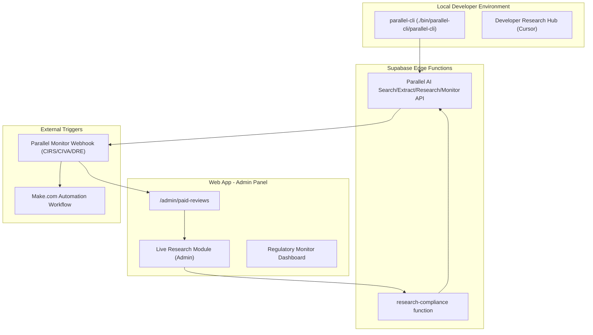

# Parallel AI Live Integration: Research & Build Plan

## Situation

We have `parallel-cli` installed locally for developer research. We also have a `research-compliance` Supabase Edge Function that performs batch searches. The user wants to integrate Parallel AI more "live" into the web app to research and search in real time while building new compliance modules.

## Architecture

## Phase 1: Local Research & Setup (NOW)

- **Install Parallel CLI** in `./bin/parallel-cli/parallel-cli`
- **Authenticate CLI** using the `PARALLEL_API_KEY` from `.env`
- **Test Deep Research** for a specific Portugal tax compliance scenario (e.g., "NHR 2.0/IFICI eligibility for US freelancers 2026")
- **Create internal documentation** for using Parallel AI in Cursor during development

## Phase 2: Live Admin Research Module

- **Add Research Hub to Admin Panel**: Create a UI in `/admin` where admins can run Parallel Search/Research directly against a specific review's context.
- **Live Context Injection**: Automatically inject a user's `form_data` into research objectives (e.g., "Research VAT rules for a freelancer with €45k turnover working with US clients").
- **Source Verification UI**: Show real-time research results alongside review data to speed up human verification before delivery.

## Phase 3: Regulatory Monitors (Accelerated)

- **Identify key monitoring targets**: (CIRS, CIVA, Diário da República, AIMA announcements).
- **Deploy Parallel Monitors**: Set up monitors for these URLs with `weekly` cadence.
- **Webhook Handler**: Create a Cloudflare/Supabase handler to receive monitor events and alert Van/Admins via Telegram or Email.

## Phase 4: AI-Driven Building (Live)

- **Compliance Rule Generator**: Use Parallel CLI to research and generate draft `portugal.ts` rules for new scenarios (e.g., D7 visa income requirements for 2026).
- **Automated Rule Validation**: Periodically run Parallel Search against existing rule citations to detect discrepancies.

---

## Agentic Workflows & Use Cases (Playbook)

Since the `parallel-cli` is installed in `./bin/parallel-cli/parallel-cli` and the native Cursor Marketplace Parallel skills are active, you can prompt the AI agent to execute these workflows directly:

### 1. Generating & Updating Tax Trap Rules (Building)

Keep `src/lib/diagnostic/rules/portugal.ts` accurate as laws change.

- **Prompt Example:** *"Use Parallel Deep Research to find out if the VAT exemption threshold in Portugal (Article 53) has changed for 2026. If it has, update the `portugal.ts` rule with the new threshold, the legal basis, and the official source URL."*
- **Agent Action:** Triggers `parallel-deep-research`, reads official Autoridade Tributária documentation on the live web, and rewrites the code to match the new laws.

### 2. Expanding to New Countries (Scaling)

When ready to expand beyond Portugal, use the modular architecture to instantly generate new country matrices.

- **Prompt Example:** *"We are ready to launch the Spain diagnostic module. Use Parallel AI to research the Beckham Law and Spanish digital nomad visa tax traps. Then, generate a `src/lib/diagnostic/rules/spain.ts` file formatted exactly like `portugal.ts`."*
- **Agent Action:** Runs a `parallel-web-search` for Spanish tax law, structures the data into the exact `conditions`, `severity`, `legal_basis`, and `penalty_range` schema, and creates the new file.

### 3. Vetting Partners for the B2B Play (Data Enrichment)

Support Phase 6.3 and Phase 7 partner outreach (immigration lawyers, accountants, relocation firms).

- **Prompt Example:** *"I have a CSV of 50 Portugal relocation firms. Use the Parallel data enrichment skill to find their CEO names, their primary contact emails, and whether they mention 'D7 Visa' on their website."*
- **Agent Action:** Uses `parallel-data-enrichment` to crawl websites simultaneously and outputs a clean, enriched dataset for cold outreach.

### 4. Setting up Regulatory Monitors (Live Monitoring)

Support Phase 5.2 by automating watches on official government URLs (CIRS, Diário da República).

- **Prompt Example:** *"Use the Parallel CLI to create a weekly monitor on the Portuguese Social Security site. Set it to trigger a webhook to our Make.com URL when the contribution rates change."*
- **Agent Action:** Executes `./bin/parallel-cli/parallel-cli monitor create` in the terminal, passing the URL and webhook from `.env` to trigger Telegram alerts via Make.com.

### 5. Reviewing a Specific Customer's Edge Case (Ad-hoc Research)

Prep for 149 EUR Clarity Calls (Phase 6.2) when a user submits a complex combination of factors.

- **Prompt Example:** *"Look at the recent diagnostic submission for user X. Use Parallel to search for the specific tax implications of active crypto trading under the grandfathered NHR regime in Madeira for 2026. Give me a summary I can use on the call."*
- **Agent Action:** Reads the user's `raw_answers` from Supabase, passes specific variables into a targeted `parallel-web-search`, and provides a tailored briefing document.

---

## Task Progress

| ID  | Task                                     | Status    | Priority |
| --- | ---------------------------------------- | --------- | -------- |
| P-1 | Install Parallel CLI locally             | COMPLETED | High     |
| P-2 | Authenticate CLI with `PARALLEL_API_KEY` | PENDING   | High     |
| P-3 | Set up regulatory monitors (CIRS, CIVA)  | PENDING   | Medium   |
| P-4 | Build "Live Research" admin interface    | PENDING   | Medium   |
| P-5 | Rule validation scripts using CLI        | PENDING   | Low      |

---

