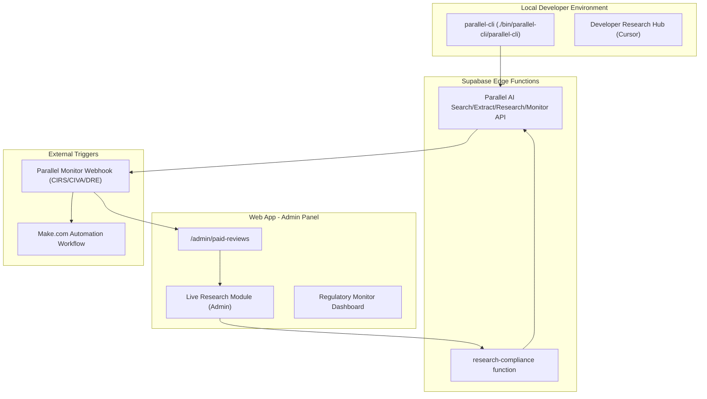

# Parallel AI Live Integration: Research & Build Plan

## Situation

We have `parallel-cli` installed locally for developer research. We also have a `research-compliance` Supabase Edge Function that performs batch searches. The user wants to integrate Parallel AI more "live" into the web app to research and search in real time while building new compliance modules.

## Architecture

## Phase 1: Local Research & Setup (NOW)

- **Install Parallel CLI** in `./bin/parallel-cli/parallel-cli`
- **Authenticate CLI** using the `PARALLEL_API_KEY` from `.env`
- **Test Deep Research** for a specific Portugal tax compliance scenario (e.g., "NHR 2.0/IFICI eligibility for US freelancers 2026")
- **Create internal documentation** for using Parallel AI in Cursor during development

## Phase 2: Live Admin Research Module

- **Add Research Hub to Admin Panel**: Create a UI in `/admin` where admins can run Parallel Search/Research directly against a specific review's context.
- **Live Context Injection**: Automatically inject a user's `form_data` into research objectives (e.g., "Research VAT rules for a freelancer with €45k turnover working with US clients").
- **Source Verification UI**: Show real-time research results alongside review data to speed up human verification before delivery.

## Phase 3: Regulatory Monitors (Accelerated)

- **Identify key monitoring targets**: (CIRS, CIVA, Diário da República, AIMA announcements).
- **Deploy Parallel Monitors**: Set up monitors for these URLs with `weekly` cadence.
- **Webhook Handler**: Create a Cloudflare/Supabase handler to receive monitor events and alert Van/Admins via Telegram or Email.

## Phase 4: AI-Driven Building (Live)

- **Compliance Rule Generator**: Use Parallel CLI to research and generate draft `portugal.ts` rules for new scenarios (e.g., D7 visa income requirements for 2026).
- **Automated Rule Validation**: Periodically run Parallel Search against existing rule citations to detect discrepancies.

---

## Task Progress

| ID  | Task                                     | Status    | Priority |
| --- | ---------------------------------------- | --------- | -------- |
| P-1 | Install Parallel CLI locally             | COMPLETED | High     |
| P-2 | Authenticate CLI with `PARALLEL_API_KEY` | PENDING   | High     |
| P-3 | Set up regulatory monitors (CIRS, CIVA)  | PENDING   | Medium   |
| P-4 | Build "Live Research" admin interface    | PENDING   | Medium   |
| P-5 | Rule validation scripts using CLI        | PENDING   | Low      |

---

