# Phase 2.5: Test, Reposition, Launch

## Why not jump to Phase 3 (Stripe) yet

Stripe checkout for 29 EUR only matters if people reach the results page. Right now:

- The homepage sends all traffic to `/checkup` (old form) and `/compliance-review` (dead product)
- Nobody can discover `/diagnostic` unless they type the URL
- The 29 EUR button on the results page is already wired (disabled with "Coming Soon") -- it creates urgency even without payment

The correct sequence: get the diagnostic discoverable first, verify submissions land in Supabase, then wire payment.

## Step 1: Test Phase 2 end-to-end (tonight, 15 min)

Before touching the homepage, manually test the full flow:

- Walk through `/diagnostic`, answer all 12 questions
- Confirm email gate appears after last question page
- Submit with a test email
- Verify the record appears in `compliance_diagnostics` table in Supabase
- Confirm results page loads at `/diagnostic/results?id=xxx`
- Check dual scores display, trap cards render, upsell CTA shows

This catches any runtime bugs before real traffic hits it.

## Step 2: Reposition the homepage (30-45 min build)

### 2a. Update ModernHero.tsx

Change the narrative from "tax compliance checkup" to "hidden risk detection":

- **Headline**: "Are you tax compliant in Portugal?" becomes something like: "You might look compliant. But are you exposed?"
- **Subheadline**: Shift from "verify your compliance" to "discover hidden risks that cost freelancers 150 to 3,750 EUR in penalties"
- **Primary CTA**: "Free Checkup (3 min)" stays but points to `/diagnostic` instead of `/checkup`
- **Kill the 49 EUR button entirely** from the hero
- **Search box text**: "Check my tax compliance status..." becomes "Find my hidden compliance risks..."

File: [src/components/accounting/ModernHero.tsx](src/components/accounting/ModernHero.tsx)

### 2b. Update ModernComplianceReviewCTA.tsx

The mid-page CTA section currently pushes the dead 49 EUR product. Two options:

- **Option A**: Rewrite it as a single-CTA block pointing to `/diagnostic` with risk-focused copy
- **Option B**: Replace it with a "How it works" section (3 steps: answer questions, get risk profile, unlock full scan)

File: [src/components/accounting/ModernComplianceReviewCTA.tsx](src/components/accounting/ModernComplianceReviewCTA.tsx)

### 2c. Update ModernFeatures.tsx

Current feature cards talk about "upstream of accountants" and "first-year tax benefits." Reframe around:

- Hidden traps that catch freelancers (dual tax residency, VAT misclassification, unfiled IRS)
- Source-verified against Portuguese law
- Penalty ranges you did not know about
- Risk detection, not readiness scoring

File: [src/components/accounting/ModernFeatures.tsx](src/components/accounting/ModernFeatures.tsx)

## Step 3: Archive the dead 49 EUR product

Do NOT delete the code or routes yet. Instead:

- Remove the `/compliance-review` button from the homepage (already done if Step 2 is complete)
- Keep the route alive but add a redirect or "This product has been retired" message
- The old `/checkup` route (TaxCheckupForm) stays in place for now -- it still works and has the 865-record benchmark. It gets retired after the new diagnostic proves itself.

Files affected:

- [src/components/accounting/ModernHero.tsx](src/components/accounting/ModernHero.tsx) -- remove 49 EUR CTA
- [src/components/accounting/ModernComplianceReviewCTA.tsx](src/components/accounting/ModernComplianceReviewCTA.tsx) -- remove or rewrite
- [src/components/ModernHomePage.tsx](src/components/ModernHomePage.tsx) -- possibly remove the `ModernComplianceReviewCTA` import if replaced

## Step 4: Phase 3 (Stripe) -- deferred until first submissions

Stripe wiring starts AFTER:

- At least 5-10 real diagnostic submissions land in `compliance_diagnostics`
- Email capture works (proves the email gate converts)
- The results page creates visible anxiety (users see traps)

Then: create a Stripe product for "Compliance Risk Scan" at 29 EUR, wire the checkout button on DiagnosticResults, update `payment_status` on success. The existing `stripe-checkout` Edge Function pattern from ConsultCheckout can be adapted.

## What this gives you

```mermaid
flowchart LR
    subgraph tonight [Tonight]
        Test["Test /diagnostic E2E"]
        Reposition["Reposition homepage"]
        Archive["Archive 49 EUR CTA"]
    end

    subgraph validation [Days 1-3]
        Traffic["Real traffic hits /diagnostic"]
        Emails["Email capture in Supabase"]
        Anxiety["Users see risk results"]
    end

    subgraph phase3 [After validation]
        Stripe["Wire Stripe 29 EUR"]
        Revenue["First paid scan"]
    end

    Test --> Reposition
    Reposition --> Archive
    Archive --> Traffic
    Traffic --> Emails
    Emails --> Anxiety
    Anxiety --> Stripe
    Stripe --> Revenue
```

## Constraints

- Do NOT delete `/compliance-review` code or Edge Functions -- just stop sending traffic to it
- Do NOT swap `/checkup` to the new diagnostic yet -- keep both alive, let `/diagnostic` prove itself
- Do NOT build Stripe integration until email submissions are flowing
- Total build time for Steps 1-3: under 2 hours tonight

